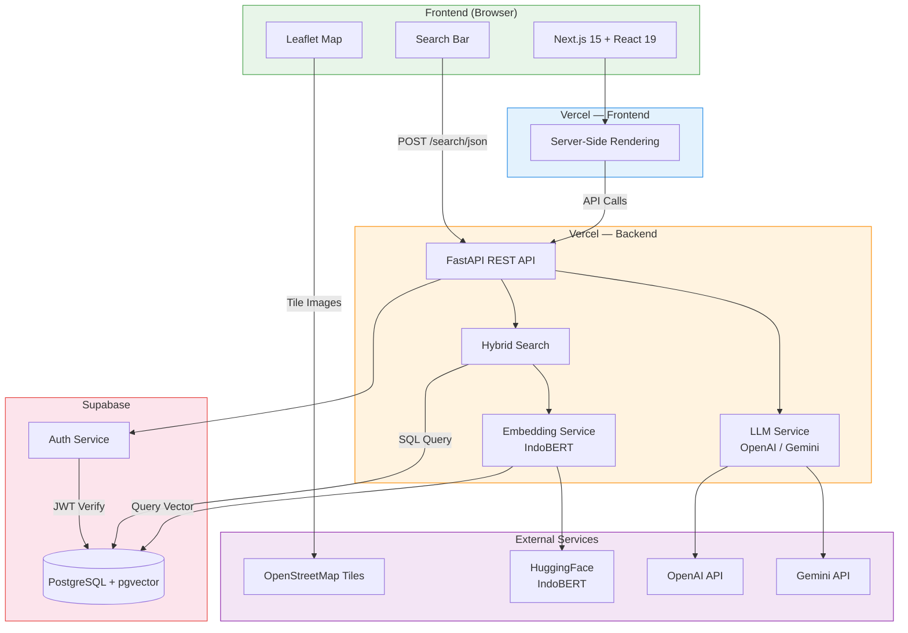
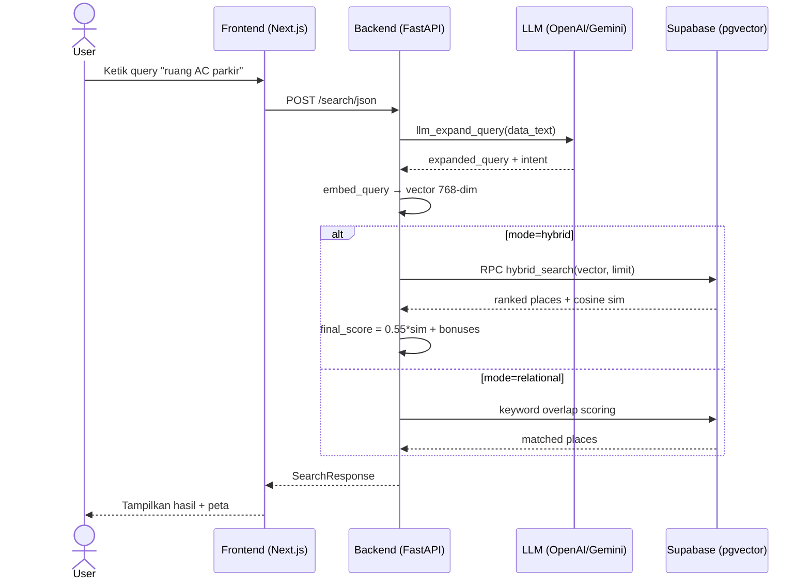
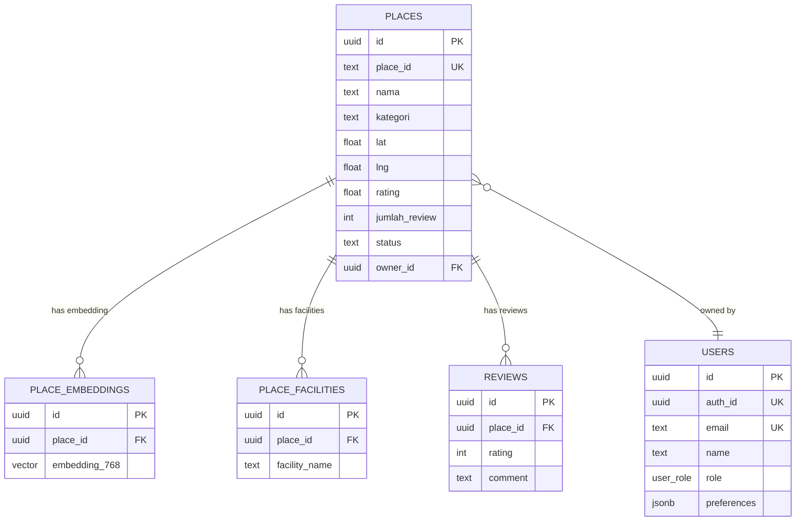

<div align="center">

# RuangSela

### Temukan Ruang, Wujudkan Kegiatan.

[](https://[URL_DEMO])
[](https://github.com/sayyidoliem/ruang-sela)
[](LICENSE)

**Submission for ITECHNO CUP 2026 - Web Development**

**Dibuat untuk mengikuti ITECHNO CUP 2026 sekaligus mengembangkan solusi digital yang dapat membantu masyarakat menemukan dan memanfaatkan ruang secara lebih optimal.**

</div>

---

## Daftar Isi

- [Tim Developer](#tim-developer)
- [Tentang Proyek](#tentang-proyek)
- [Fitur Unggulan](#fitur-unggulan)
- [Demo & Screenshot](#demo--screenshot)
- [Tech Stack](#tech-stack)
- [Arsitektur Sistem](#arsitektur-sistem)
- [Struktur Repository](#struktur-repository)
- [Instalasi & Setup](#instalasi--setup)
- [API Documentation](#api-documentation)
- [Penggunaan](#penggunaan)
- [Lisensi](#lisensi)

---

## Tim Developer

| Nama | Peran | GitHub |
| --- | ----- | ------ |
| **Sayyid Muhammad Muslim As'ad Sunarko** | Project Lead & Front-end Developer | [GitHub](https://github.com/sayyidoliem) |
| **Michael Kristianto** | Back-end Developer | [GitHub](https://github.com/emkax) |
| **Muhammad Ryan Apriansyah** | UI/UX Designer & Front-end Developer | [GitHub](https://github.com/ryanocks) |

---

## Tentang Proyek

### Latar Belakang

Jakarta merupakan kota dengan aktivitas masyarakat dan komunitas yang sangat beragam. Namun, kebutuhan terhadap ruang yang dapat digunakan untuk berbagai aktivitas masih menjadi tantangan. Informasi mengenai lokasi, fasilitas, kapasitas, harga, ketersediaan jadwal, dan mekanisme pengajuan tempat belum tentu mudah ditemukan dalam satu platform.

### Solusi yang Ditawarkan

**RuangSela** merupakan platform digital yang membantu masyarakat dan komunitas menemukan serta mengajukan penggunaan tempat sesuai dengan kebutuhan kegiatan mereka.

Platform ini menyediakan informasi mengenai: lokasi tempat, kapasitas, fasilitas, harga, ketersediaan jadwal, rating dan ulasan, informasi kontak, serta mekanisme pengajuan penggunaan tempat.

### Tujuan Proyek

- **Tujuan Utama**: Mempermudah masyarakat dan komunitas dalam menemukan serta mengajukan penggunaan ruang yang sesuai dengan kebutuhan kegiatan mereka.
- **Target Pengguna**: Masyarakat, mahasiswa, komunitas, organisasi, penyelenggara kegiatan, serta pengelola tempat di wilayah Jakarta.
- **Value Proposition**: Menyatukan proses pencarian, eksplorasi informasi, pengecekan ketersediaan, dan pengajuan tempat dalam satu platform.

---

## Fitur Unggulan

| Fitur | Deskripsi |
| ----- | --------- |
| **Pencarian Tempat** | Mencari tempat berdasarkan kebutuhan kegiatan dengan filter kategori, fasilitas, dan lokasi |
| **Detail Tempat** | Informasi lengkap: foto, lokasi, kapasitas, fasilitas, harga, jam operasional, dan kontak |
| **Jadwal Ketersediaan** | Menampilkan jadwal dan slot waktu yang tersedia pada suatu tempat |
| **Pengajuan Tempat** | Pengajuan penggunaan tempat sesuai tanggal, waktu, dan kebutuhan kegiatan |
| **Ulasan & Rating** | Rating dan ulasan dari pengguna lain |
| **Peta & Lokasi** | Peta OpenStreetMap dengan marker lokasi tempat |
| **Manajemen Tempat** | Pengelola dapat mengelola informasi tempat yang didaftarkan |
| **Dashboard Admin** | Monitoring pengguna, tempat, pengajuan, dan aktivitas platform |
| **Rekomendasi** | Tempat rekomendasi berdasarkan profil dan preferensi pengguna |
| **Verifikasi** | Verifikasi tempat dan pengguna oleh admin |

---

## Demo & Screenshot

### Live Demo

🔗 **[Kunjungi Website](https://[URL_DEMO])**

### Screenshot Aplikasi

<div align="center">
  
  <p><em>Homepage - Tampilan utama aplikasi</em></p>

  
  <p><em>Pencarian Tempat - Filter dan pencarian ruang</em></p>

  
  <p><em>Detail Tempat - Informasi lengkap suatu tempat</em></p>

  
  <p><em>Dashboard Admin - Panel monitoring platform</em></p>

  
  <p><em>Dashboard Pengelola - Panel monitoring platform</em></p>
</div>

---

## Tech Stack

### Frontend

| Technology | Version | Purpose |
|---|---|---|
| Next.js | 15.5 | React framework (App Router, SSR, SSG, Turbopack) |
| React | 19.1 | UI library |
| TypeScript | 5.9 | Type safety |
| Tailwind CSS | 4.1 | Utility-first CSS |
| Lucide React | 0.542 | Icon library |
| Leaflet | 1.9 | Peta OpenStreetMap |
| React Hook Form | 7.62 | Form handling |
| Zod | 4.1 | Schema validation |
| Vitest | 3.2 | Unit testing |
| Playwright | 1.55 | E2E testing |

### Backend

| Technology | Version | Purpose |
|---|---|---|
| Python | 3.10+ | Runtime |
| FastAPI | 0.110 | REST API framework |
| Supabase | 2.15+ | PostgreSQL + pgvector + Auth |
| OpenAI | 1.52 | LLM API (query expansion) |
| httpx | 0.27 | HTTP client (Gemini REST fallback) |
| Mangum | 0.17 | AWS Lambda / Vercel serverless adapter |
| IndoBERT | - | Embedding model (768-dim, local only) |

### Scraper

| Technology | Version | Purpose |
|---|---|---|
| Playwright | 1.48 | Browser automation (Chromium) |
| Pandas | 2.2 | Data manipulation & export CSV |
| openpyxl | 3.1 | Excel export |

### Database

| Technology | Purpose |
|---|---|
| PostgreSQL | Relational database (via Supabase) |
| pgvector | Vector similarity search (IndoBERT 768-dim) |

### Deployment

| Platform | Technology | Purpose |
|---|---|---|
| Vercel | Next.js 15 | Frontend hosting + CI/CD |
| Vercel | Python 3.10 | Backend serverless (FastAPI + Mangum) |
| Supabase | PostgreSQL + Auth | Database, vector search, authentication |

---

## Arsitektur Sistem

### High-Level Architecture



### Search Flow



### Hybrid Search Weights

```
final_score = 0.55 × sim_score         (IndoBERT cosine similarity)
            + facility_bonus            (+0.15 AC, +0.10 parkir, +0.05 lega)
            + busy_bonus                ((40 - busy_pct)/40 × 0.15)
            + rating_norm               (rating/5 × 0.05)
            + geo_bonus                 ((10 - dist_km)/10 × 0.05)
```

### Database Schema (ERD)



---

## Struktur Repository

```
ruang-sela/
├── front-end/              # Next.js 15 Frontend
│   ├── src/
│   │   ├── app/            # App Router pages
│   │   ├── features/       # Feature modules (auth, admin, manager)
│   │   ├── components/     # Shared components
│   │   └── config/         # Environment config (Zod validated)
│   ├── public/             # Static assets & screenshots
│   └── package.json
│
├── BE/                     # FastAPI Backend (Python)
│   ├── app/
│   │   ├── routers/        # API routers (auth, search, locations, admin)
│   │   ├── services/       # Business logic (embed, search, LLM)
│   │   ├── middleware/     # Auth middleware
│   │   └── main.py         # FastAPI app entry
│   ├── supabase/           # SQL migrations (users, schema, RPC)
│   └── requirements.txt
│
├── api/                    # Vercel serverless entrypoint
│   └── index.py
│
├── scraper/                # Google Maps Scraper (Playwright)
│   ├── main.py             # Entry point
│   ├── search.py           # Maps search logic
│   ├── detail.py           # Page detail scraper
│   ├── export.py           # JSON/CSV export
│   ├── config.py           # Constants
│   ├── models.py           # Place model
│   └── auth.py             # Cookie auth
│
├── scripts/                # Utility scripts (ETL, bulk scrape)
│   ├── collect_75.py       # Bulk collect 75 places
│   ├── bulk_detail_cookie.py
│   └── resume_bulk.py
│
├── data/                   # Scraped output data
│   └── raw/                # JSON + CSV datasets
│
└── vercel.json             # Root Vercel config
```

---

## Instalasi & Setup

### 1. Clone & Install

```bash
git clone https://github.com/sayyidoliem/ruang-sela.git
cd ruang-sela

# Frontend
cd front-end && npm install && cd ..

# Backend
cd BE && pip install -r requirements.txt && cd ..
```

### 2. Setup Environment Variables

**Frontend** — buat `front-end/.env.local`:

```env
NEXT_PUBLIC_APP_URL=http://localhost:3000
NEXT_PUBLIC_API_URL=http://localhost:8000
# NEXT_PUBLIC_API_URL=https://ruang-sela-be.vercel.app  # production

# Supabase (opsional untuk auth)
NEXT_PUBLIC_SUPABASE_URL=
NEXT_PUBLIC_SUPABASE_ANON_KEY=

# AI Keys (opsional)
AI_API_KEY=
AI_BASE_URL=
```

**Backend** — buat `BE/.env`:

```env
SUPABASE_URL=https://your-project.supabase.co
SUPABASE_SERVICE_KEY=your-service-role-key
SUPABASE_ANON_KEY=your-anon-key

# Auth / OAuth
PUBLIC_API_URL=http://localhost:8000
FRONTEND_URL=http://localhost:3000

# LLM Provider (pilih salah satu)
OPENAI_API_KEY=sk-...
GEMINI_API_KEY=AIza...

# Optional
ADMIN_KEY=changeme
MODEL_NAME=indobenchmark/indobert-base-p1
```

### 3. Jalankan

```bash
# Terminal 1: Backend
cd BE
uvicorn app.main:app --reload --port 8000

# Terminal 2: Frontend
cd front-end
npm run dev
```

### 4. Akses

| Service | URL |
|---|---|
| Frontend | http://localhost:3000 |
| Login | http://localhost:3000/login |
| Register | http://localhost:3000/signup |
| Backend API | http://localhost:8000 |
| API Docs | http://localhost:8000/docs |

### 5. Scraper (Opsional)

```bash
pip install -r requirements.txt -r requirements-scraper.txt
playwright install chromium

# Sampel 5 tempat Jakarta Barat
python -m scraper.main --limit 5 --location "Jakarta Barat"

# Bulk 75 tempat DKI
python scripts/collect_75.py
```

Output tersimpan di `data/raw/` dalam format `.json` dan `.csv`.

> **Tanpa Supabase/Model:** Frontend tetap berjalan menggunakan backend hosted (ruang-sela-be.vercel.app).

---

## API Documentation

### Backend Endpoints (Hosted)

| Method | Endpoint | Auth | Description |
|---|---|---|---|
| GET | `/health` | Public | Status server + model |
| GET | `/locations` | USER/ADMIN | Daftar tempat |
| GET | `/location/:id` | USER/ADMIN | Detail tempat |
| POST | `/location` | USER/ADMIN | Ajukan tempat baru |
| POST | `/search/json` | ALL | Pencarian hybrid (LLM + IndoBERT) |
| GET | `/recommendations` | USER | Rekomendasi berdasarkan profil |
| GET | `/profile` | USER | Ambil profil |
| PUT | `/profile` | USER | Update preferensi |
| POST | `/admin/verifyLocation` | ADMIN | Verifikasi tempat |
| DELETE | `/admin/deleteLocation/:id` | ADMIN | Hapus tempat |

### Auth Endpoints (via BE `/auth`)

| Method | Endpoint | Description |
|---|---|---|
| POST | `/auth/signup` | Daftar via Supabase Auth |
| POST | `/auth/login` | Login (email + password) |
| POST | `/auth/logout` | Keluar (revoke session) |
| GET | `/auth/me` | Ambil data user dari JWT |
| GET | `/auth/google` | Mulai Google OAuth |
| GET | `/auth/google/callback` | OAuth callback → redirect ke FE |

📖 **[Dokumentasi API Lengkap](https://github.com/sayyidoliem/ruang-sela/blob/master/BE/docs/API.md)**

### Contoh Request

```typescript
// Login
const response = await fetch("http://localhost:8000/auth/login", {
  method: "POST",
  headers: { "Content-Type": "application/json" },
  body: JSON.stringify({
    email: "user@example.com",
    password: "password123",
  }),
});
const data = await response.json();
// { data: { user: {...}, session: { access_token: "..." } } }
```

```typescript
// Cari Lokasi
const response = await fetch("http://localhost:8000/locations?limit=10", {
  headers: { "Authorization": "Bearer <jwt_token>" },
});
const data = await response.json();
```

```typescript
// Search (JSON + LLM)
const response = await fetch("http://localhost:8000/search/json", {
  method: "POST",
  headers: {
    "Content-Type": "application/json",
    "Authorization": "Bearer <jwt_token>",
  },
  body: JSON.stringify({
    data_text: "ruangan yang memiliki AC dan juga parkir",
    top_k: 10,
    mode: "hybrid",
  }),
});
const data = await response.json();
```

---

## Penggunaan

### Untuk Pengguna Umum

1. **Registrasi/Login** — Buat akun atau masuk untuk mengakses fitur RuangSela.
2. **Mencari Tempat** — Filter berdasarkan kategori, kapasitas, fasilitas, dan harga.
3. **Melihat Detail Tempat** — Foto, lokasi, fasilitas, harga, ketersediaan, dan ulasan.
4. **Mengajukan Tempat** — Pilih tanggal dan waktu yang tersedia, kirimkan pengajuan.
5. **Pengajuan Saya** — Pantau status pengajuan melalui menu Pengajuan Saya.
6. **Memberikan Ulasan** — Berikan rating dan ulasan setelah penggunaan tempat.

### Untuk Manager / Pengelola Tempat

1. **Dashboard & Analitik** — Total booking, booking diproses, disetujui, pendapatan, tren.
2. **Mendaftarkan Tempat** — Tambahkan informasi, fasilitas, harga, foto, dan detail.
3. **Mengatur Ketersediaan** — Atur tanggal dan slot waktu.
4. **Mengelola Pengajuan** — Lihat, terima, atau tolak pengajuan.

### Untuk Admin

1. **Dashboard** — Monitoring pengguna, booking, pendapatan, status tempat.
2. **Verifikasi Tempat** — Periksa dan verifikasi tempat yang didaftarkan manager.
3. **Verifikasi User** — Kelola status dan verifikasi akun pengguna.

---

## Lisensi

Proyek ini dilisensikan di bawah [MIT License](LICENSE) - lihat file LICENSE untuk detail lebih lanjut.

---

<div align="center">

**Made with ❤️ for ITECHNO CUP 2026**

</div>