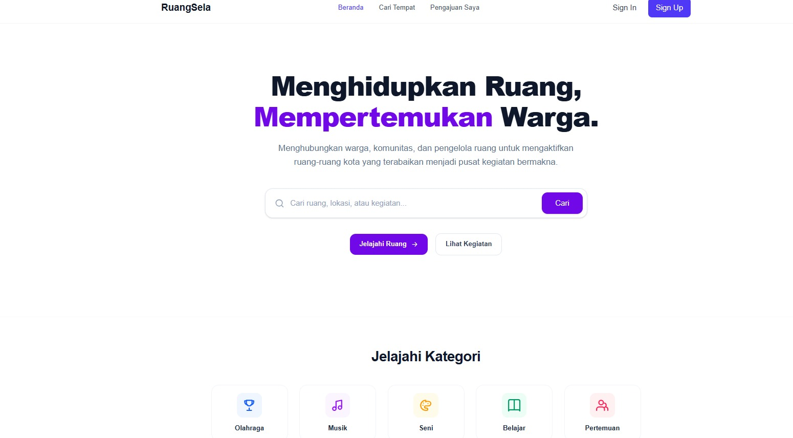
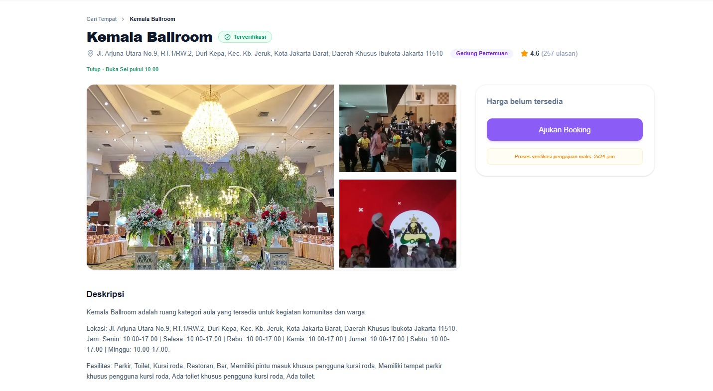
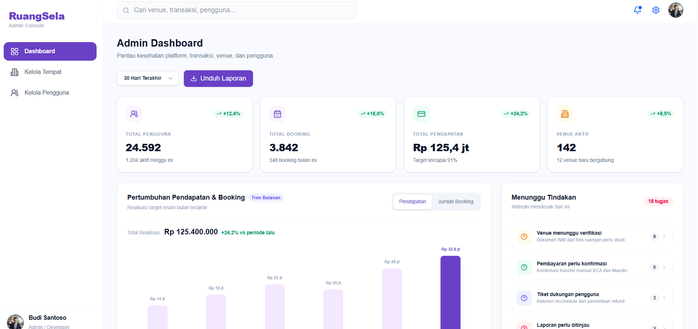
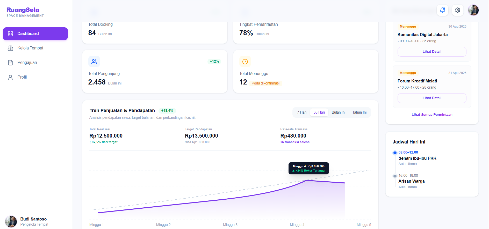
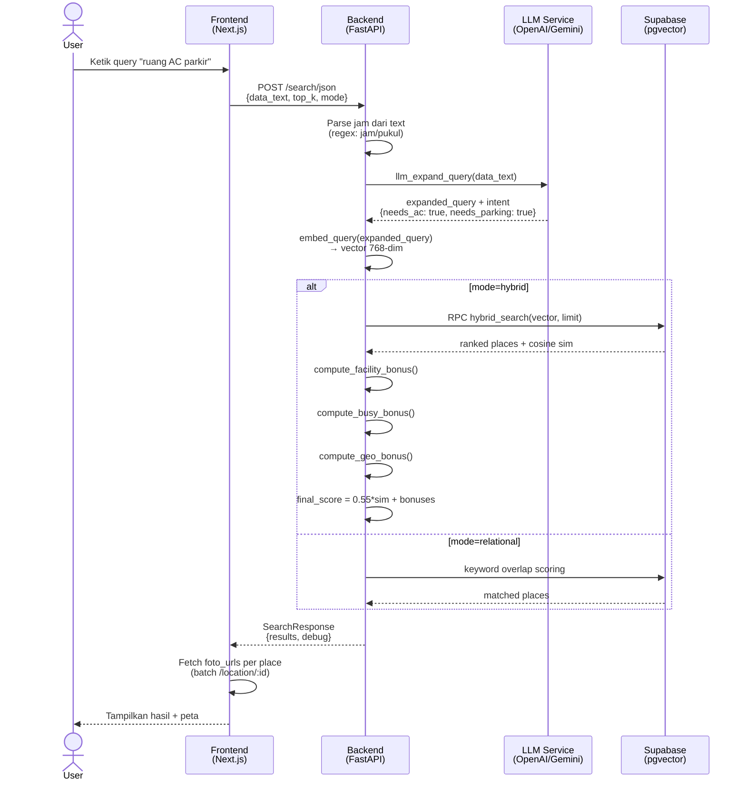
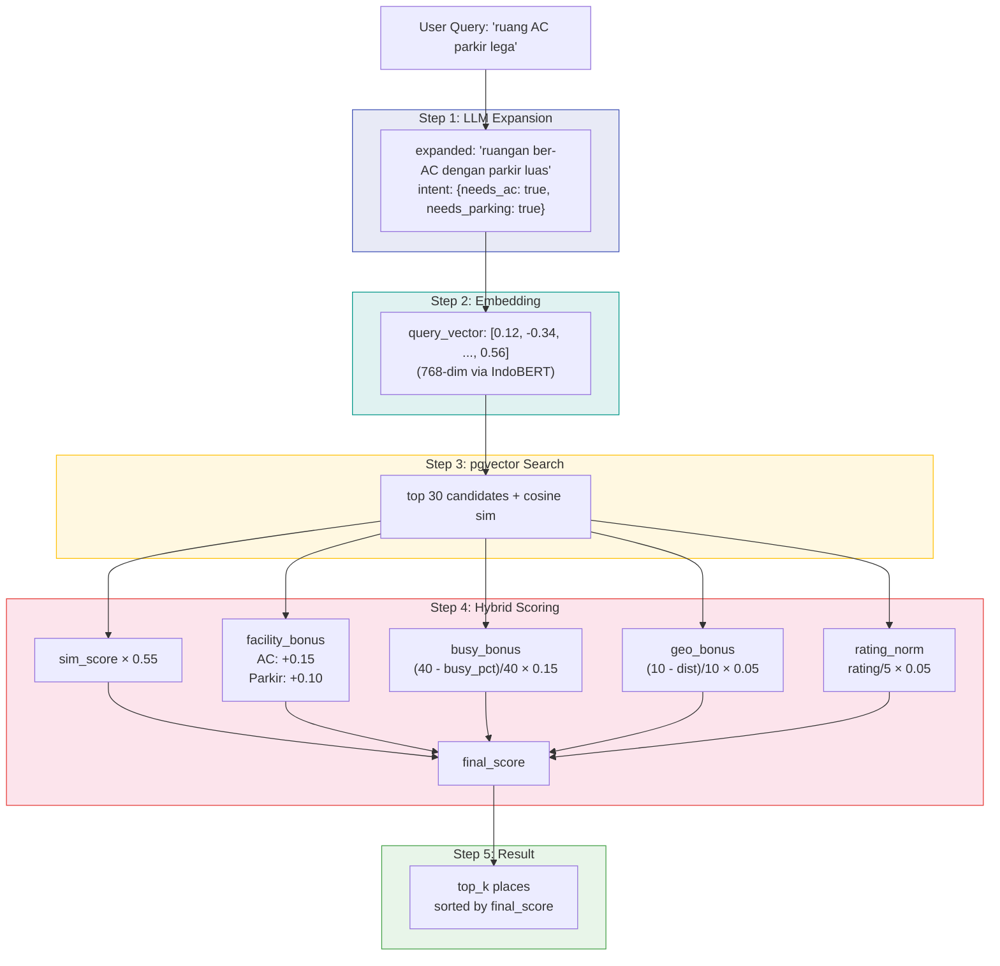
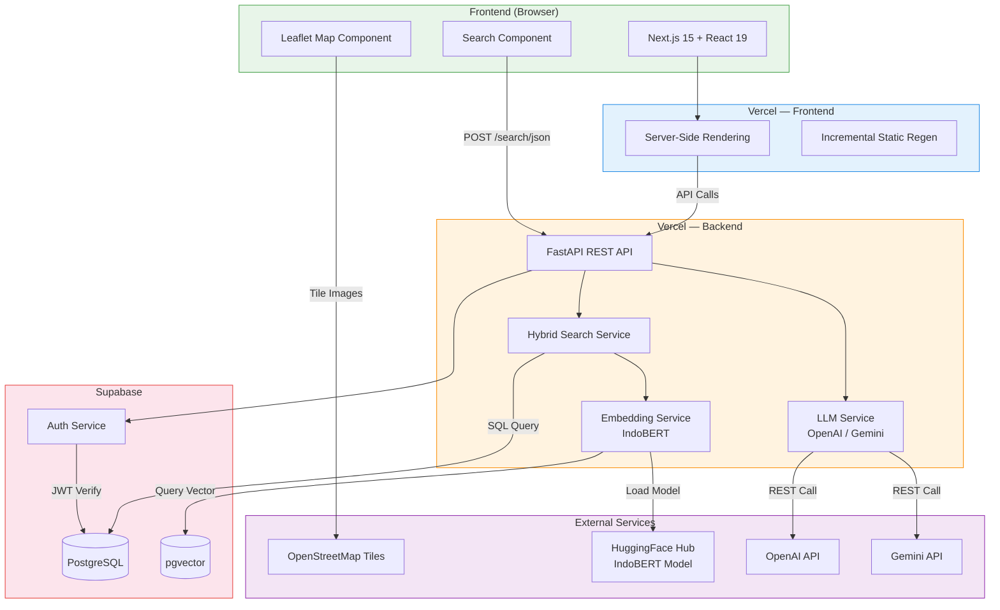
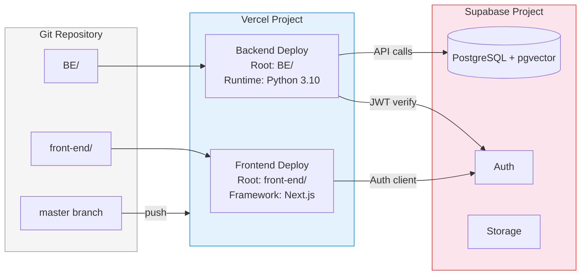
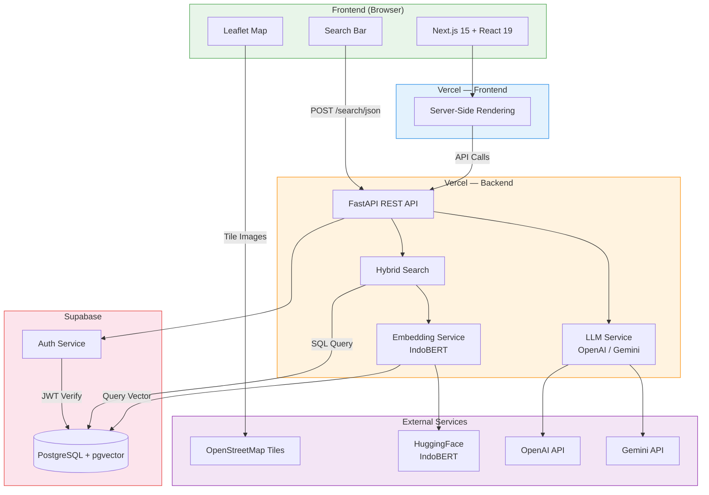
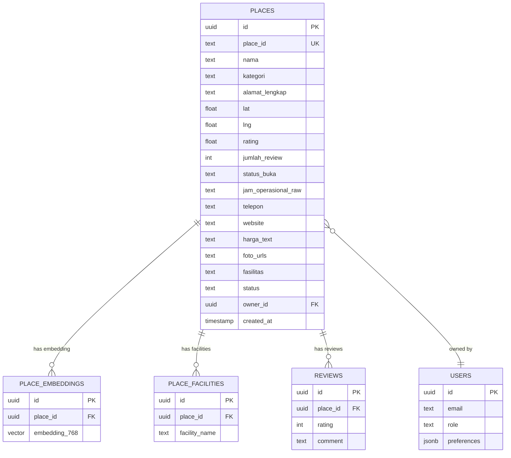

<div align="center">
  
  # RuangSela 
  ### Temukan Ruang, Wujudkan Kegiatan.

  [](https://[URL_DEMO])
  [](https://github.com/sayyidoliem/ruang-sela)
  [](LICENSE)
  
  **Submission for ITECHNO CUP 2026 - Web Development**
  
  **Dibuat untuk mengikuti ITECHNO CUP 2026 sekaligus mengembangkan solusi digital yang dapat membantu masyarakat menemukan dan memanfaatkan ruang secara lebih optimal.**
  
</div>

---

## 📋 Daftar Isi

* [Tentang Proyek](#-tentang-proyek)
* [Fitur Unggulan](#-fitur-unggulan)
* [Demo & Screenshot](#-demo--screenshot)
* [Teknologi](#-teknologi)
* [Arsitektur Sistem](#-arsitektur-sistem)
* [Instalasi & Setup](#-instalasi--setup)
* [Penggunaan](#-penggunaan)
* [API Documentation](#-api-documentation)
* [Testing](#-testing)
* [Tim Developer](#-tim-pengembang)
* [Lisensi](#-lisensi)

---

## 👥 Tim Developer

| Nama | Peran | GitHub |
| ---- | ----- | ------ |
| **Sayyid Muhammad Muslim As'ad Sunarko** | Project Lead & Front-end Developer | [GitHub](https://github.com/sayyidoliem) |
| **Michael Kristianto** | Back-end Developer | [GitHub](https://github.com/emkax) |
| **Muhammad Ryan Apriansyah** | UI/UX Designer & Front-end Developer | [GitHub](https://github.com/ryanocks) |

---

## 🎯 Tentang Proyek

### Latar Belakang

Jakarta merupakan kota dengan aktivitas masyarakat dan komunitas yang sangat beragam, mulai dari kegiatan sosial, pendidikan, kreatif, hingga organisasi. Namun, kebutuhan terhadap ruang yang dapat digunakan untuk berbagai aktivitas tersebut masih menjadi tantangan.

Dinas Perpustakaan dan Kearsipan Provinsi DKI Jakarta menyoroti minimnya ruang publik yang dapat digunakan secara bebas di Jakarta. Ruang publik memiliki peran penting dalam mendukung masyarakat untuk belajar, berkarya, berkolaborasi, serta menjalankan berbagai aktivitas komunitas.

Di sisi lain, persoalan tidak hanya berkaitan dengan jumlah ruang, tetapi juga bagaimana ruang yang tersedia dapat dimanfaatkan secara optimal. Penelitian mengenai taman kota di Jakarta menunjukkan bahwa hanya sebagian kecil taman kota yang dimanfaatkan masyarakat sebagai wadah kegiatan kreatif, sementara sebagian lainnya lebih banyak digunakan untuk aktivitas rekreasi dan berkumpul.

Pemerintah Provinsi DKI Jakarta juga terus mendorong pengembangan dan optimalisasi ruang publik. Luas Ruang Terbuka Hijau (RTH) Jakarta masih berada di sekitar 5,2% dari luas wilayah Jakarta, sementara pemerintah menargetkan peningkatan proporsi RTH hingga 30% pada tahun 2030.

Permasalahan tersebut juga berkaitan dengan visibilitas dan akses informasi mengenai tempat yang tersedia. Masyarakat atau komunitas dapat memiliki kebutuhan terhadap ruang untuk berkegiatan, sementara di sisi lain terdapat berbagai tempat dengan fasilitas dan kapasitas yang berpotensi dimanfaatkan. Namun, informasi mengenai lokasi, fasilitas, kapasitas, harga, ketersediaan jadwal, dan mekanisme pengajuan tempat belum tentu mudah ditemukan dalam satu platform.

### Solusi yang Ditawarkan

**RuangSela** merupakan platform digital yang membantu masyarakat dan komunitas menemukan serta mengajukan penggunaan tempat sesuai dengan kebutuhan kegiatan mereka.

Platform ini menyediakan informasi mengenai:

* 📍 Lokasi tempat
* 👥 Kapasitas
* 🏢 Fasilitas
* 💰 Harga
* 📅 Ketersediaan jadwal
* ⭐ Rating dan ulasan
* 📞 Informasi kontak tempat
* 📝 Mekanisme pengajuan penggunaan tempat

Bagi pengguna, RuangSela mempermudah proses pencarian dan pengajuan tempat tanpa harus mencari informasi dari berbagai sumber secara terpisah.

Sementara bagi pengelola tempat, RuangSela membantu meningkatkan visibilitas tempat yang mereka miliki sehingga lebih mudah ditemukan oleh calon pengguna.

Dengan mempertemukan kebutuhan pengguna dengan tempat yang tersedia, RuangSela bertujuan menciptakan ekosistem pemanfaatan ruang yang lebih mudah diakses, informatif, dan efisien.

### Tujuan Proyek

* 🎯 **Tujuan Utama**: Mempermudah masyarakat dan komunitas dalam menemukan serta mengajukan penggunaan ruang yang sesuai dengan kebutuhan kegiatan mereka.

* 📊 **Target Pengguna**: Masyarakat, mahasiswa, komunitas, organisasi, penyelenggara kegiatan, serta pengelola tempat di wilayah Jakarta.

* 💡 **Value Proposition**: Menyatukan proses pencarian, eksplorasi informasi, pengecekan ketersediaan, dan pengajuan tempat dalam satu platform sehingga ruang yang tersedia menjadi lebih mudah ditemukan dan dimanfaatkan.

---

## ✨ Fitur Unggulan

### Fitur Utama

| Fitur | Deskripsi | Keunggulan |
| ----- | --------- | ---------- |
| **Pencarian Tempat** | Pengguna dapat mencari tempat berdasarkan kebutuhan kegiatan dan informasi tempat. | Mempercepat proses menemukan ruang yang sesuai. |
| **Detail Tempat** | Menampilkan informasi lengkap mengenai tempat, seperti foto, lokasi, kapasitas, fasilitas, harga, jam operasional, dan informasi kontak. | Pengguna dapat memahami kondisi tempat sebelum mengajukan penggunaan. |
| **Jadwal Ketersediaan** | Menampilkan jadwal dan slot waktu yang tersedia pada suatu tempat. | Membantu pengguna mengetahui waktu yang dapat digunakan sebelum melakukan pengajuan. |
| **Pengajuan Tempat** | Pengguna dapat mengajukan penggunaan tempat sesuai tanggal, waktu, dan kebutuhan kegiatan. | Membuat proses pengajuan menjadi lebih terstruktur dan praktis. |
| **Ulasan & Rating** | Pengguna dapat melihat pengalaman pengguna lain melalui rating dan ulasan. | Membantu pengguna mempertimbangkan kualitas tempat sebelum memilih. |
| **Peta & Lokasi** | Menampilkan lokasi tempat dan informasi akses. | Memudahkan pengguna memahami lokasi dan akses menuju tempat. |
| **Manajemen Tempat** | Pengelola dapat mengelola informasi tempat yang mereka daftarkan. | Membantu pengelola menjaga informasi tempat tetap relevan dan mudah ditemukan. |
| **Dashboard Admin** | Admin dapat memantau pengguna, tempat, pengajuan, pendapatan, serta aktivitas platform. | Mempermudah pengelolaan dan pengawasan platform. |

### Fitur Tambahan

* **Rekomendasi Tempat** - Menampilkan tempat yang dapat menjadi pilihan berdasarkan kebutuhan pengguna.
* **Trending Places** - Menampilkan tempat yang sedang banyak dilihat atau diminati.
* **Filter Tempat** - Membantu pengguna mempersempit hasil pencarian berdasarkan kategori dan karakteristik tempat.
* **Status Pengajuan** - Pengguna dapat melihat perkembangan pengajuan mulai dari menunggu hingga selesai.
* **Verifikasi Tempat** - Admin dapat melakukan proses verifikasi terhadap tempat yang didaftarkan oleh pengelola.
* **Verifikasi Pengguna** - Admin dapat memantau dan mengelola status pengguna.
* **Riwayat Pengajuan** - Pengguna dapat melihat seluruh riwayat pengajuan tempat yang pernah dilakukan.
* **Manajemen Fasilitas** - Informasi fasilitas ditampilkan berdasarkan fasilitas yang benar-benar tersedia pada masing-masing tempat.

---

## 📸 Demo & Screenshot

### Live Demo

🔗 **[Kunjungi Website](https://[URL_DEMO])**

> URL demo akan ditambahkan setelah deployment aplikasi tersedia.

### Screenshot Aplikasi

<div align="center">
  
  <p><em>Homepage - Tampilan utama aplikasi</em></p>

  
  <p><em>Pencarian Tempat - Filter dan pencarian ruang</em></p>

  
  <p><em>Detail Tempat - Informasi lengkap suatu tempat</em></p>

  
  <p><em>Dashboard Admin - Panel monitoring platform</em></p>

  
  <p><em>Dashboard Pengelola - Panel monitoring platform</em></p>

</div>


### Video Demo

📹 **[Link Video Demo](https://[URL_VIDEO])**

> Link video demo akan ditambahkan setelah video demonstrasi aplikasi tersedia.

---

## 🛠️ Teknologi

### Tech Stack

## Frontend

| Technology | Version | Purpose |
|---|---|---|
| *Next.js* | 15.5 | React framework (App Router, SSR, SSG, Turbopack) |
| *React* | 19.1 | UI library |
| *TypeScript* | 5.9 | Type safety |
| *Tailwind CSS* | 4.1 | Utility-first CSS |
| *Zod* | 4.1 | Schema validation |
| *React Hook Form* | 7.62 | Form handling + validation |
| *@supabase/ssr* | 0.7 | Supabase server-side auth |
| *@supabase/supabase-js* | 2.56 | Supabase client SDK |
| *Leaflet* | 1.9 | Peta OpenStreetMap (marker, tile, zoom) |
| *Lucide React* | 0.542 | Icon library |
| *Vitest* | 3.2 | Unit testing |
| *Playwright* | 1.55 | E2E testing |
| *ESLint* | 9.34 | Linting |

### Deployment

| Platform | Purpose |
|---|---|
| *Vercel* | Frontend hosting + CI/CD dari branch master |

---

## Backend

| Technology | Version | Purpose |
|---|---|---|
| *Python* | 3.10+ | Runtime |
| *FastAPI* | 0.110 | REST API framework |
| *Uvicorn* | 0.29 | ASGI server |
| *Pydantic* | 2.8 | Data validation & schemas |
| *pydantic-settings* | 2.4 | Environment config |
| *Supabase* | 2.15+ | PostgreSQL + pgvector (database & vector search) |
| *OpenAI* | 1.52 | LLM API (GPT query expansion) |
| *Gemini (REST)* | - | LLM fallback via httpx direct REST |
| *httpx* | 0.27 | HTTP client (Gemini REST) |
| *Mangum* | 0.17 | AWS Lambda / Vercel serverless adapter |
| *python-dotenv* | 1.0 | .env loader |
| *python-multipart* | 0.09 | File upload support |

### ML / Embedding (Local Only)

| Technology | Version | Purpose |
|---|---|---|
| *PyTorch* | 2.4 | Deep learning runtime |
| *Transformers* | 4.44 | HuggingFace tokenizer + model |
| *NumPy* | 1.26 | Numerical computation |

> *Catatan:* torch dan transformers tidak diinstal di Vercel (melebihi limit 250MB). Hosting fallback ke dummy_embedding (hash-based). ML deps hanya dipakai lokal untuk job embedding.

### Deployment

| Platform | Purpose |
|---|---|
| *Vercel* | Python serverless (FastAPI via Mangum) |
| *Supabase* | PostgreSQL + pgvector + Auth |

---

## Scraper

| Technology | Version | Purpose |
|---|---|---|
| *Playwright* | 1.48 | Browser automation (Chromium) |
| *Pandas* | 2.2 | Data manipulation & export CSV |
| *openpyxl* | 3.1 | Excel export |

---

## Database

| Technology | Purpose |
|---|---|
| *PostgreSQL* | Relational database (via Supabase) |
| *pgvector* | Vector similarity search (embedding IndoBERT 768-dim) |

### Schema

| Tabel | Description |
|---|---|
| places | Data tempat (nama, kategori, alamat, lat/lng, rating, foto, jam operasional) |
| place_embeddings | Vektor embedding 768-dim (pgvector) |
| place_facilities | Relasi many-to-many tempat ↔️ fasilitas |
| reviews | Ulasan pengguna |

---

## AI / ML Pipeline

### Search Flow



### Hybrid Search Scoring



### Hybrid Search Weights


final_score = 0.55 × sim_score         (IndoBERT cosine similarity)
            + facility_bonus            (+0.15 AC, +0.10 parkir, +0.05 lega)
            + busy_bonus                ((40 - busy_pct)/40 × 0.15)
            + rating_norm               (rating/5 × 0.05)
            + geo_bonus                 ((10 - dist_km)/10 × 0.05)


---

## API Endpoints Summary

### Backend (ruang-sela-be.vercel.app)

| Method | Endpoint | Auth | Description |
|---|---|---|---|
| GET | /health | Public | Status server + model |
| GET | /locations | USER/ADMIN | Daftar tempat |
| GET | /location/:id | USER/ADMIN | Detail tempat |
| POST | /location | USER/ADMIN | Ajukan tempat baru |
| POST | /search/json | ALL | Pencarian hybrid (LLM + IndoBERT) |
| GET | /recommendations | USER | Rekomendasi berdasarkan profil |
| GET | /profile | USER | Ambil profil |
| PUT | /profile | USER | Update preferensi |
| POST | /admin/verifyLocation | ADMIN | Verifikasi tempat |
| DELETE | /admin/deleteLocation/:id | ADMIN | Hapus tempat |

> Dokumentasi lengkap: [API.md](https://github.com/sayyidoliem/ruang-sela/blob/back-end/BE/docs/API.md)

---

## Infrastructure

### High-Level Architecture



### Deployment Architecture



| Layer | Technology | Hosting |
|---|---|---|
| Frontend | Next.js 15 + React 19 | Vercel |
| Backend | FastAPI + Python 3.10 | Vercel (serverless) |
| Database | PostgreSQL + pgvector | Supabase |
| Auth | Supabase Auth | Supabase |
| AI/ML | IndoBERT + OpenAI/Gemini | HuggingFace + API |
| Map | Leaflet + OpenStreetMap | OpenStreetMap tiles |


### Alasan Pemilihan Teknologi

| Teknologi | Alasan Pemilihan |
| --------- | ----------------- |
| **Next.js** | Digunakan sebagai framework utama karena mendukung pengembangan aplikasi web modern dengan routing, rendering, dan struktur project yang terorganisir. |
| **TypeScript** | Membantu meningkatkan type safety dan mengurangi kesalahan saat pengembangan aplikasi. |
| **Tailwind CSS** | Mempermudah pembuatan antarmuka yang konsisten, responsif, dan dapat dikembangkan dengan cepat. |
| **Figma** | Digunakan untuk merancang UI/UX sebelum implementasi ke dalam aplikasi. |
| **Git & GitHub** | Digunakan untuk version control dan memudahkan kolaborasi antar anggota tim. |
| **Vercel** | Digunakan sebagai platform deployment yang terintegrasi dengan workflow Next.js. |
| **Supabase** | Digunakan sebagai backend platform yang menyediakan PostgreSQL database, authentication, storage, serta API sehingga proses pengembangan backend dapat dilakukan secara efisien. |
| **PostgreSQL** | Digunakan sebagai database relasional untuk menyimpan data pengguna, tempat, pengajuan, fasilitas, jadwal, dan ulasan. |

### Dependencies Utama

```json
{
  "name": "itechno-cup-nextjs-starter",
  "version": "1.0.0",
  "private": true,
  "scripts": {
    "dev": "next dev --turbopack",
    "build": "next build",
    "start": "next start",
    "lint": "eslint .",
    "typecheck": "tsc --noEmit",
    "test": "vitest run",
    "test:watch": "vitest",
    "test:e2e": "playwright test",
    "quality": "npm run typecheck && npm run test && npm run build"
  },
  "dependencies": {
    "@hookform/resolvers": "^5.2.1",
    "@supabase/ssr": "^0.7.0",
    "@supabase/supabase-js": "^2.56.1",
    "lucide-react": "^0.542.0",
    "next": "^15.5.2",
    "react": "^19.1.1",
    "react-dom": "^19.1.1",
    "react-hook-form": "^7.62.0",
    "zod": "^4.1.5"
  },
  "devDependencies": {
    "@eslint/eslintrc": "^3.3.1",
    "@playwright/test": "^1.55.0",
    "@tailwindcss/postcss": "^4.1.12",
    "@testing-library/jest-dom": "^6.8.0",
    "@testing-library/react": "^16.3.0",
    "@types/node": "22.20.1",
    "@types/react": "19.2.18",
    "@types/react-dom": "^19.1.9",
    "eslint": "^9.34.0",
    "eslint-config-next": "^15.5.2",
    "jsdom": "^26.1.0",
    "tailwindcss": "^4.1.12",
    "typescript": "5.9.3",
    "vitest": "^3.2.4"
  }
}
```

---

## 🏗️ Arsitektur Sistem

### System Architecture



### Database Schema

**ERD (Entity Relationship Diagram):**



**Skema Tabel:**

```
TABLE: places
* id                  uuid       PK
* place_id            text
* cid                 text
* keyword             text
* nama                text
* kategori            text
* kategori_list       text
* alamat              text
* alamat_lengkap      text
* plus_code           text
* lat                 float8
* lng                 float8
* geom                geography
* rating              float8
* jumlah_review       int
* jam_operasional     json
* jam_operasional_raw text
* status_buka         text
* popular_times_raw   text
* jam_ramai           text
* telepon             text
* website             text
* harga_text          text
* price_level         text
* price_range         text
* deskripsi           text
* scraped_at          timestamp
* total_open_hours    float8
* is_24h              bool
* has_weekend         bool
* facility_score      int
* fasilitas_raw       text
* foto_urls           text[]
* foto_count          int
* created_at          timestamp

TABLE: reviews
* id        uuid   PK
* place_id  uuid   FK -> places.id
* text      text
* rating    int
* hash      text

TABLE: busy_hours
* place_id     uuid   FK -> places.id
* day          text
* hour         int
* busy_percent int

TABLE: place_facilities
* place_id    uuid   FK -> places.id
* facility_id int    FK -> facilities.id
* is_negative bool

TABLE: facilities
* id         int    PK
* name       text
* is_generic bool

TABLE: place_embeddings
* place_id   uuid        FK -> places.id
* content    text
* embedding  vector
* model      text
* updated_at timestamptz

TABLE: eval_queries
* id        uuid   PK
* query_text text
* lat       float8
* lng       float8
* radius_m  int

TABLE: eval_results
* id          uuid   PK
* query_id    uuid   FK -> eval_queries.id
* system      text
* place_id    uuid   FK -> places.id
* rank        int
* sim         float8
* final_score float8
* llm_score   int

TABLE: spatial_ref_sys
* srid      int    PK
* auth_name varchar
* auth_srid int
* srtext    varchar
* proj4text varchar
```

### Folder Structure

```
ruang-sela/
├── docs/
├── public/
│   └── images/
│
├── src/
│   ├── app/
│   │   ├── (admin)/
│   │   ├── (manager)/
│   │   ├── (public)/
│   │   ├── (settings)/
│   │   ├── (user)/
│   │   ├── api/
│   │   ├── components/
│   │   ├── error.tsx
│   │   ├── favicon.ico
│   │   ├── globals.css
│   │   ├── layout.tsx
│   │   ├── loading.tsx
│   │   ├── not-found.tsx
│   │   └── page.tsx
│   │
│   ├── config/
│   ├── features/
│   └── shared/
│
├── tests/
│
├── .env.example
├── .gitignore
├── eslint.config.mjs
├── next-env.d.ts
├── next.config.ts
├── package.json
├── playwright.config.ts
├── postcss.config.mjs
├── README.md
├── SECURITY.md
├── tsconfig.json
└── vitest.config.ts
```

---

## ⚙️ Instalasi & Setup


## Struktur Repository

ruang-sela/
├── front-end/          # Next.js 15 Frontend
├── BE/                 # FastAPI Backend (Python)
├── api/                # Vercel serverless entrypoint
├── data/               # Data mentah (CSV/JSON)
├── scraper/            # Google Maps Scraper (Playwright)
├── scripts/            # Utility scripts
└── vercel.json         # Root Vercel config


---

## 1. Frontend (Next.js)

### Prerequisites

- *Node.js* >= 18.x
- *npm* >= 9.x

### Install

bash
cd front-end
npm install


### Environment Variables

Buat file front-end/.env.local:

env
NEXT_PUBLIC_APP_URL=http://localhost:3000
NEXT_PUBLIC_API_URL=https://ruang-sela-be.vercel.app

# Supabase (opsional untuk auth)
NEXT_PUBLIC_SUPABASE_URL=
NEXT_PUBLIC_SUPABASE_ANON_KEY=
SUPABASE_SERVICE_ROLE_KEY=

# AI Keys (opsional)
AI_API_KEY=
AI_BASE_URL=


| Variable | Required | Description |
|---|---|---|
| NEXT_PUBLIC_APP_URL | Ya | URL frontend (default: http://localhost:3000) |
| NEXT_PUBLIC_API_URL | Ya | URL backend hosted (default: https://ruang-sela-be.vercel.app) |
| NEXT_PUBLIC_SUPABASE_URL | Tidak | Supabase project URL |
| NEXT_PUBLIC_SUPABASE_ANON_KEY | Tidak | Supabase anonymous key |

### Jalankan

bash
npm run dev          # Development (http://localhost:3000)
npm run build        # Production build
npm start            # Jalankan production build
npm run lint         # Linting
npm run typecheck    # Type check TypeScript
npm run test         # Unit tests


### Deployment (Vercel)

Framework: Next.js. Deploy otomatis dari branch master.

*Root Directory:* front-end/

---

## 2. Backend (FastAPI)

### Prerequisites

- *Python* >= 3.10
- *pip*

### Install

bash
cd BE
pip install -r requirements.txt


Untuk fitur ML embedding lokal (opsional — hanya untuk ETL/embedding script):

bash
pip install -r requirements.ml.txt


### Environment Variables

Buat file BE/.env:

env
SUPABASE_URL=https://your-project.supabase.co
SUPABASE_SERVICE_KEY=eyJhbGci...
SUPABASE_ANON_KEY=eyJhbGci...

# LLM Provider (pilih salah satu)
OPENAI_API_KEY=sk-...          # OpenAI
GEMINI_API_KEY=AIza...         # Google Gemini (fallback)

# Opsional
ADMIN_KEY=changeme
MODEL_NAME=indobenchmark/indobert-base-p1
HF_TOKEN=hf_...               # Jika model private


| Variable | Required | Description |
|---|---|---|
| SUPABASE_URL | Ya | URL project Supabase |
| SUPABASE_SERVICE_KEY | Ya* | Supabase service role key (*fallback: SUPABASE_SERVICE_ROLE_KEY) |
| SUPABASE_ANON_KEY | Tidak | Supabase anon key |
| OPENAI_API_KEY | Tidak | API key OpenAI untuk LLM search |
| GEMINI_API_KEY | Tidak | API key Google Gemini (jika tidak pakai OpenAI) |
| ADMIN_KEY | Tidak | Key untuk endpoint admin (default: changeme) |
| MODEL_NAME | Tidak | Nama model IndoBERT (default: indobenchmark/indobert-base-p1) |

### Jalankan

bash
cd BE
uvicorn app.main:app --reload --port 8000


Backend berjalan di http://localhost:8000

### API Docs

- Swagger UI: http://localhost:8000/docs
- OpenAPI JSON: http://localhost:8000/openapi.json
- Health check: http://localhost:8000/health

### Deployment (Vercel)

Backend di-deploy via Vercel Python serverless.

*Root Directory:* BE/

> *Catatan Vercel:* File requirements.txt di BE/ tidak menyertakan torch/transformers (melebihi limit 250MB). Backend akan fallback ke embedding berbasis hash saat model tidak tersedia.

---

## 3. Scraper (Playwright)

### Prerequisites

- *Python* >= 3.10
- *pip*
- *Playwright Chromium* (diinstall otomatis)

### Install

bash
pip install -r requirements.txt
pip install -r requirements-scraper.txt
playwright install chromium


### Jalankan

bash
# Sampel 5 tempat Jakarta Barat
python -m scraper.main --limit 5 --location "Jakarta Barat"

# Headless mode
python -m scraper.main --limit 5 --headless

# Bulk 75 tempat DKI
python scripts/collect_75.py


Output tersimpan di data/raw/ dalam format .json dan .csv.

---

## 4. Database (Supabase)

### Schema

Schema SQL tersedia di:

- BE/supabase/schema.sql — DDL lengkap (tabel, index, vector)
- BE/supabase/rpc.sql — RPC function hybrid_search untuk pgvector

### Setup

1. Buat project di [Supabase](https://supabase.com)
2. Jalankan schema.sql di SQL Editor Supabase
3. Jalankan rpc.sql untuk membuat fungsi hybrid search
4. Import data dari BE/schema/places.csv ke tabel places
5. Jalankan ETL untuk embedding:
   bash
   cd BE
   pip install -r requirements.txt -r requirements.ml.txt
   python scripts/etl_bulk75.py
   python scripts/embed_places.py
   

### Tabel Utama

| Tabel | Description |
|---|---|
| places | Data tempat/ruang |
| place_embeddings | Vektor embedding (pgvector) |
| place_facilities | Relasi tempat ↔️ fasilitas |
| users | Data pengguna |

---

## Quick Start

### 1. Clone & Install

bash
git clone https://github.com/sayyidoliem/ruang-sela.git
cd ruang-sela

# Frontend
cd front-end && npm install && cd ..

# Backend
cd BE && pip install -r requirements.txt && cd ..


### 2. Setup Environment

bash
# Frontend
cp front-end/.env.example front-end/.env.local
# Edit .env.local sesuai kebutuhan

# Backend
cp BE/.env.example BE/.env  # atau buat manual
# Edit .env dengan credential Supabase dan API key


### 3. Jalankan

bash
# Terminal 1: Backend
cd BE
uvicorn app.main:app --reload --port 8000

# Terminal 2: Frontend
cd front-end
npm run dev


### 4. Akses

| Service | URL |
|---|---|
| Frontend | http://localhost:3000 |
| Backend API | http://localhost:8000 |
| Backend Docs | http://localhost:8000/docs |

> *Tanpa Supabase/Model:* Frontend tetap berjalan menggunakan backend hosted (ruang-sela-be.vercel.app). Search menggunakan fallback lokal (keyword scoring). Gambar & detail tetap ter-load dari endpoint hosted.
---

## 🚀 Penggunaan

### Menjalankan Aplikasi

```bash
# Development mode
npm run dev

# Production build
npm run build
```

### User Guide

#### Untuk Pengguna Umum

1. **Registrasi/Login**: Membuat akun atau masuk untuk mengakses fitur RuangSela.
2. **Mencari Tempat**: Mencari dan memfilter tempat berdasarkan kebutuhan, kategori, kapasitas, fasilitas, dan harga.
3. **Melihat Detail Tempat**: Melihat foto, lokasi, fasilitas, harga, ketersediaan, dan ulasan tempat.
4. **Mengajukan Tempat**: Memilih tanggal dan waktu yang tersedia kemudian mengirimkan pengajuan penggunaan tempat.
5. **Pengajuan Saya**: Memantau status seluruh pengajuan melalui menu Pengajuan Saya.
6. **Memberikan Ulasan**: Memberikan rating dan ulasan setelah penggunaan tempat selesai.

#### Untuk Manager / Pengelola Tempat

1. **Dashboard & Analitik**: Melihat performa tempat melalui informasi seperti total booking, booking yang diproses, booking disetujui, pendapatan, tingkat penggunaan tempat, dan tren booking.
2. **Mendaftarkan Tempat**: Menambahkan informasi tempat, fasilitas, harga, foto, dan detail lainnya.
3. **Mengelola Tempat**: Memperbarui informasi, fasilitas, harga, dan jam operasional tempat.
4. **Mengatur Ketersediaan**: Mengatur tanggal dan slot waktu yang dapat digunakan oleh pengguna.
5. **Mengelola Pengajuan**: Melihat, menerima, atau menolak pengajuan penggunaan tempat.
6. **Melihat Ulasan**: Memantau rating dan ulasan pengguna terhadap tempat yang dikelola.

#### Untuk Admin

1. **Akses Admin Panel**: Masuk menggunakan akun administrator untuk mengakses dashboard.
2. **Dashboard**: Memantau pengguna, booking, pendapatan, dan status tempat.
3. **Verifikasi Tempat**: Memeriksa dan memverifikasi tempat yang didaftarkan oleh manager.
4. **Verifikasi User**: Mengelola status dan verifikasi akun pengguna.
5. **Monitoring**: Memantau pengajuan, aktivitas platform, dan pendapatan.

---

## 📚 API Documentation

### Base URL

```
| Environment | URL |
|---|---|
| Development | http://localhost:3000/api |
| Production | https://[domain]/api |

> Frontend di-deploy secara terpisah. API request dari client-side langsung ke backend hosted.

## Backend Hosted

| Environment | URL |
|---|---|
| Production | https://ruang-sela-be.vercel.app |

> Dokumentasi lengkap endpoint backend: [API.md (back-end branch)](https://github.com/sayyidoliem/ruang-sela/blob/back-end/BE/docs/API.md)

---

## Authentication

| Method | Endpoint | Description |
|---|---|---|
| POST | /api/auth/register | Register akun baru |
| POST | /api/auth/login | Login dan dapatkan token |
| POST | /api/auth/logout | Hapus sesi / logout |
| GET | /api/auth/me | Ambil data user yang sedang login |

### Auth Headers


Authorization: Bearer <jwt_token>
X-Role: USER | ADMIN          (mock dev mode)
X-User-Id: <uuid>             (mock dev mode)


---

## Resource Endpoints (CRUD)

| Method | Endpoint | Description |
|---|---|---|
| GET | /api/[resource] | Ambil semua data |
| GET | /api/[resource]/:id | Ambil data berdasarkan ID |
| POST | /api/[resource] | Buat data baru |
| PUT | /api/[resource]/:id | Update data |
| DELETE | /api/[resource]/:id | Hapus data |

---

## Backend Endpoints (Hosted)

Berikut mapping endpoint backend https://ruang-sela-be.vercel.app yang digunakan frontend:

### Public

| Method | Endpoint | Description |
|---|---|---|
| GET | /health | Cek status server dan model |
| POST | /search/json | Pencarian hybrid (LLM + IndoBERT) |
| POST | /search/file | Pencarian via file JSON (legacy) |
| GET | /search/test?q=... | Quick test pencarian (tanpa auth) |
| GET | /locations | Daftar lokasi (USER: published, ADMIN: all) |
| GET | /location/:id | Detail lokasi |
| GET | /recommendations | Rekomendasi berdasarkan profil user |

### Auth Required

| Method | Endpoint | Description |
|---|---|---|
| GET | /profile | Ambil profil user |
| PUT | /profile | Update preferensi profil |
| POST | /location | Ajukan lokasi baru (USER → pending, ADMIN → published) |

### Admin Only

| Method | Endpoint | Description |
|---|---|---|
| POST | /admin/verifyLocation | Verifikasi / tolak lokasi pending |
| DELETE | /admin/deleteLocation/:id | Hapus lokasi |

---

## Example Request

### Login

ts
const response = await fetch("https://ruang-sela-be.vercel.app/profile", {
  method: "GET",
  headers: {
    "X-Role": "USER",
  },
});
const data = await response.json();


### Cari Lokasi

ts
const response = await fetch("https://ruang-sela-be.vercel.app/locations?limit=10&offset=0", {
  headers: { "X-Role": "USER" },
});
const data = await response.json();
// { role: "USER", total: 75, data: [...] }


### Detail Lokasi

ts
const response = await fetch("https://ruang-sela-be.vercel.app/location/11cs0c_3z7", {
  headers: { "X-Role": "USER" },
});
const data = await response.json();
// { nama: "...", kategori: "...", foto_urls: [...], fasilitas: [...], ... }


### Search (JSON + LLM)

ts
const response = await fetch("https://ruang-sela-be.vercel.app/search/json", {
  method: "POST",
  headers: {
    "Content-Type": "application/json",
    "X-Role": "USER",
  },
  body: JSON.stringify({
    data_text: "ruangan yang memiliki AC dan juga parkir",
    top_k: 10,
    mode: "hybrid",
  }),
});
const data = await response.json();
// { query: "...", results: [...], debug: {...} }


### Ajukan Lokasi Baru

ts
const response = await fetch("https://ruang-sela-be.vercel.app/location", {
  method: "POST",
  headers: {
    "Content-Type": "application/json",
    "X-Role": "USER",
  },
  body: JSON.stringify({
    nama: "Aula Warga Baru",
    alamat: "Jl. Contah No. 1, Jakarta",
    lat: -6.17,
    lng: 106.76,
    kategori: "Aula serbaguna",
    fasilitas: ["Parkir", "AC"],
  }),
});
const data = await response.json();
// { place_id: "...", status: "pending", message: "Menunggu verifikasi admin" }


### Verifikasi Lokasi (Admin)

ts
const response = await fetch("https://ruang-sela-be.vercel.app/admin/verifyLocation", {
  method: "POST",
  headers: {
    "Content-Type": "application/json",
    "X-Role": "ADMIN",
  },
  body: JSON.stringify({
    location_id: "11new_xxx",
    action: "accept",
  }),
});


---

## Error Response Format

json
{
  "detail": "Error message dari server"
}


Validation error (422):

json
{
  "detail": [
    {
      "loc": ["body", "nama"],
      "msg": "String should have at least 3 characters",
      "type": "string_too_short"
    }
  ]
}

```javascript
// Login
const response = await fetch("/api/auth/login", {
  method: "POST",
  headers: { "Content-Type": "application/json" },
  body: JSON.stringify({
    email: "user@example.com",
    password: "password123",
  }),
});
```

📖 **[Dokumentasi API Lengkap](./docs/API.md)** _(opsional)_

---

## 📄 Lisensi

Proyek ini dilisensikan di bawah [MIT License](LICENSE) - lihat file LICENSE untuk detail lebih lanjut.

---

<div align="center">

**Made with ❤️ for ITECHNO CUP 2026**

</div>
