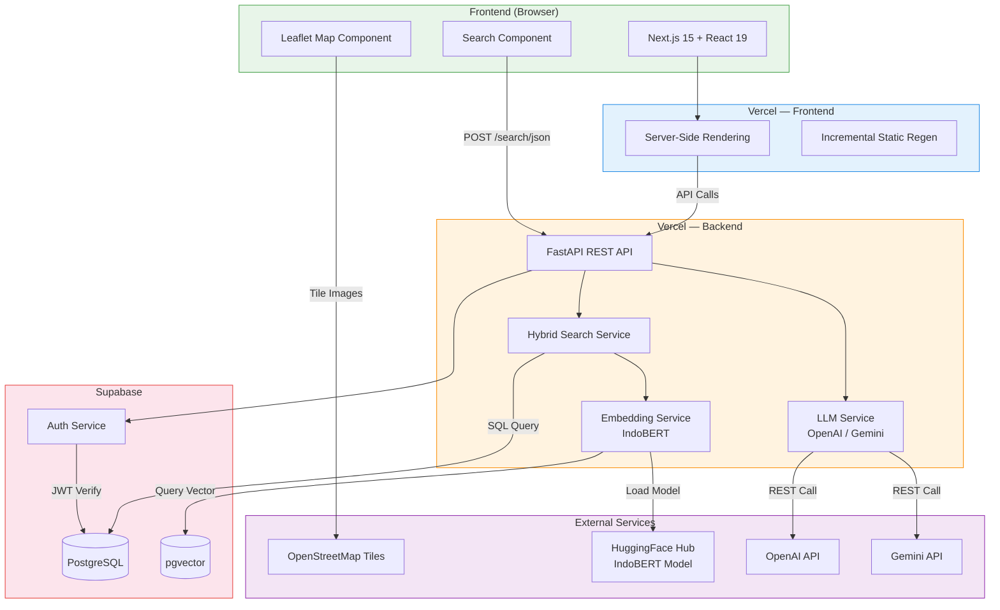
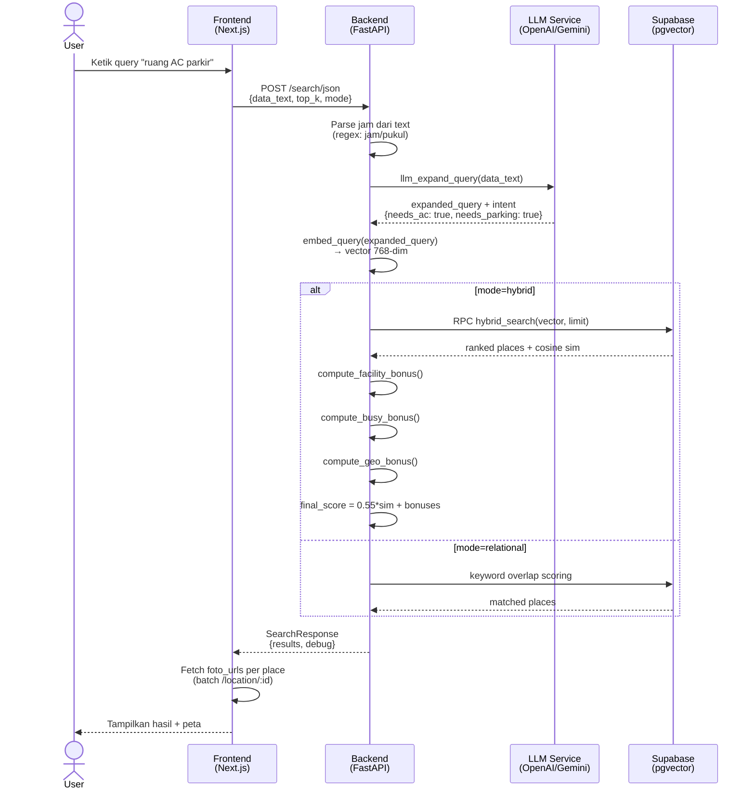
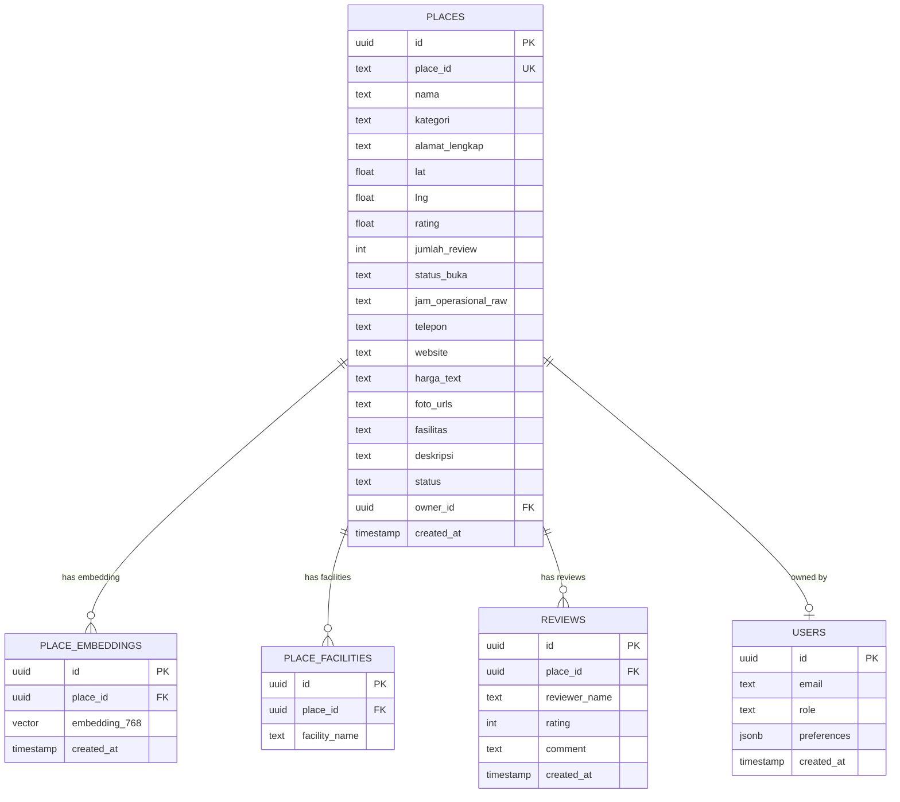
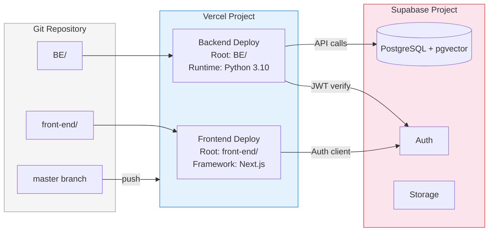
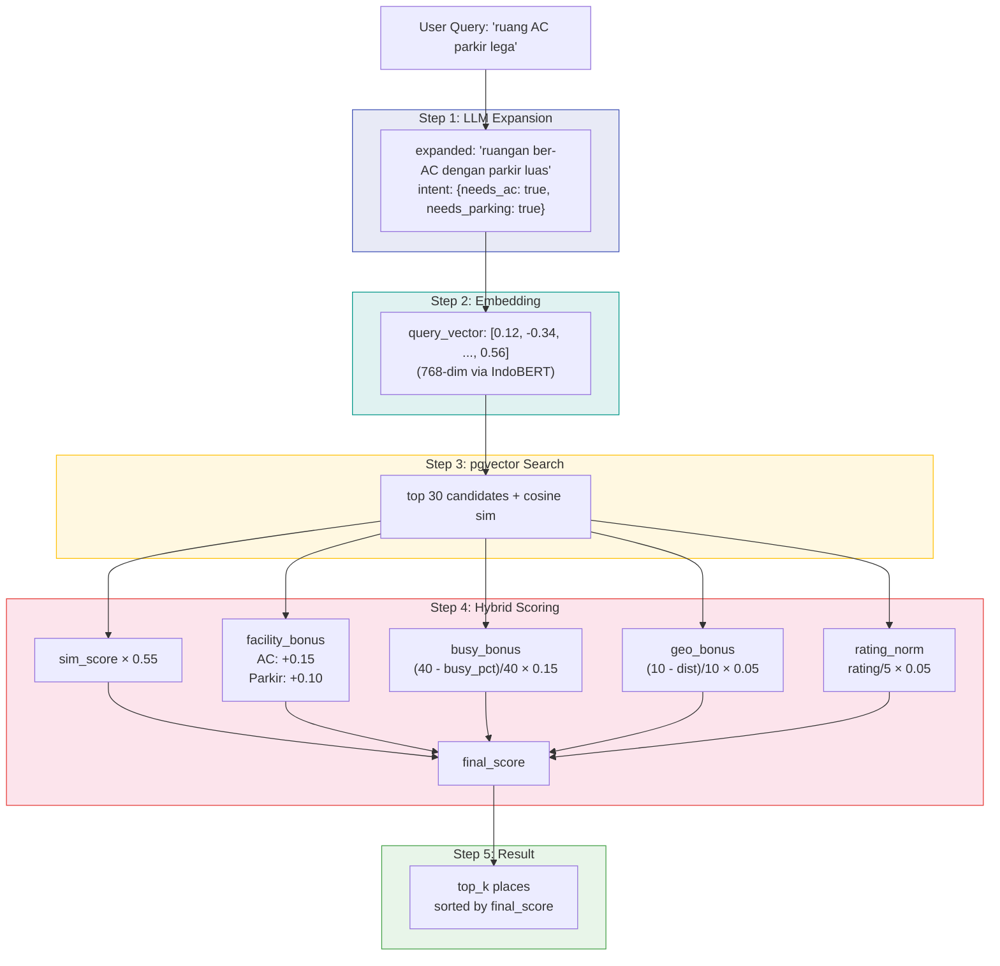

# TECH-STACK.md — Teknologi yang Digunakan

## Frontend

| Technology | Version | Purpose |
|---|---|---|
| **Next.js** | 15.5 | React framework (App Router, SSR, SSG, Turbopack) |
| **React** | 19.1 | UI library |
| **TypeScript** | 5.9 | Type safety |
| **Tailwind CSS** | 4.1 | Utility-first CSS |
| **Zod** | 4.1 | Schema validation |
| **React Hook Form** | 7.62 | Form handling + validation |
| **@supabase/ssr** | 0.7 | Supabase server-side auth |
| **@supabase/supabase-js** | 2.56 | Supabase client SDK |
| **Leaflet** | 1.9 | Peta OpenStreetMap (marker, tile, zoom) |
| **Lucide React** | 0.542 | Icon library |
| **Vitest** | 3.2 | Unit testing |
| **Playwright** | 1.55 | E2E testing |
| **ESLint** | 9.34 | Linting |

### Deployment

| Platform | Purpose |
|---|---|
| **Vercel** | Frontend hosting + CI/CD dari branch `master` |

---

## Backend

| Technology | Version | Purpose |
|---|---|---|
| **Python** | 3.10+ | Runtime |
| **FastAPI** | 0.110 | REST API framework |
| **Uvicorn** | 0.29 | ASGI server |
| **Pydantic** | 2.8 | Data validation & schemas |
| **pydantic-settings** | 2.4 | Environment config |
| **Supabase** | 2.15+ | PostgreSQL + pgvector (database & vector search) |
| **OpenAI** | 1.52 | LLM API (GPT query expansion) |
| **Gemini (REST)** | - | LLM fallback via httpx direct REST |
| **httpx** | 0.27 | HTTP client (Gemini REST) |
| **Mangum** | 0.17 | AWS Lambda / Vercel serverless adapter |
| **python-dotenv** | 1.0 | `.env` loader |
| **python-multipart** | 0.09 | File upload support |

### ML / Embedding (Local Only)

| Technology | Version | Purpose |
|---|---|---|
| **PyTorch** | 2.4 | Deep learning runtime |
| **Transformers** | 4.44 | HuggingFace tokenizer + model |
| **NumPy** | 1.26 | Numerical computation |

> **Catatan:** `torch` dan `transformers` tidak diinstal di Vercel (melebihi limit 250MB). Hosting fallback ke `dummy_embedding` (hash-based). ML deps hanya dipakai lokal untuk job embedding.

### Deployment

| Platform | Purpose |
|---|---|
| **Vercel** | Python serverless (FastAPI via Mangum) |
| **Supabase** | PostgreSQL + pgvector + Auth |

---

## Scraper

| Technology | Version | Purpose |
|---|---|---|
| **Playwright** | 1.48 | Browser automation (Chromium) |
| **Pandas** | 2.2 | Data manipulation & export CSV |
| **openpyxl** | 3.1 | Excel export |

---

## Database

| Technology | Purpose |
|---|---|
| **PostgreSQL** | Relational database (via Supabase) |
| **pgvector** | Vector similarity search (embedding IndoBERT 768-dim) |

### Schema

| Tabel | Description |
|---|---|
| `places` | Data tempat (nama, kategori, alamat, lat/lng, rating, foto, jam operasional) |
| `place_embeddings` | Vektor embedding 768-dim (pgvector) |
| `place_facilities` | Relasi many-to-many tempat ↔ fasilitas |
| `reviews` | Ulasan pengguna |

---

## AI / ML Pipeline

```
User Query (natural language)
        │
        ▼
┌─────────────────────┐
│  LLM Expansion      │  OpenAI GPT / Google Gemini
│  (intent parsing)   │  → expanded_query + intent
└─────────┬───────────┘
          │
          ▼
┌─────────────────────┐
│  IndoBERT Embedding  │  indobenchmark/indobert-base-p1
│  (768-dim vector)   │  → query vector
└─────────┬───────────┘
          │
          ▼
┌─────────────────────┐
│  pgvector Search     │  Supabase RPC hybrid_search
│  (cosine similarity)│  → ranked results
└─────────┬───────────┘
          │
          ▼
┌─────────────────────┐
│  Hybrid Scoring      │  sim + facility + busy + geo + rating
│  (soft filter)      │  → final ranked places
└─────────────────────┘
```

### Hybrid Search Weights

```
final_score = 0.55 × sim_score         (IndoBERT cosine similarity)
            + facility_bonus            (+0.15 AC, +0.10 parkir, +0.05 lega)
            + busy_bonus                ((40 - busy_pct)/40 × 0.15)
            + rating_norm               (rating/5 × 0.05)
            + geo_bonus                 ((10 - dist_km)/10 × 0.05)
```

---

## API Endpoints Summary

### Backend (`ruang-sela-be.vercel.app`)

| Method | Endpoint | Auth | Description |
|---|---|---|---|
| GET | `/health` | Public | Status server + model |
| GET | `/locations` | USER/ADMIN | Daftar tempat |
| GET | `/location/:id` | USER/ADMIN | Detail tempat |
| POST | `/location` | USER/ADMIN | Ajukan tempat baru |
| POST | `/search/json` | ALL | Pencarian hybrid (LLM + IndoBERT) |
| GET | `/recommendations` | USER | Rekomendasi berdasarkan profil |
| GET | `/profile` | USER | Ambil profil |
| PUT | `/profile` | USER | Update preferensi |
| POST | `/admin/verifyLocation` | ADMIN | Verifikasi tempat |
| DELETE | `/admin/deleteLocation/:id` | ADMIN | Hapus tempat |

> Dokumentasi lengkap: [API.md](https://github.com/sayyidoliem/ruang-sela/blob/back-end/BE/docs/API.md)

---

## Arsitektur Sistem

### High-Level Architecture



### Search Flow



### Database Schema (ERD)



### Deployment Architecture



### Hybrid Search Scoring



| Layer | Technology | Hosting |
|---|---|---|
| Frontend | Next.js 15 + React 19 | Vercel |
| Backend | FastAPI + Python 3.10 | Vercel (serverless) |
| Database | PostgreSQL + pgvector | Supabase |
| Auth | Supabase Auth | Supabase |
| AI/ML | IndoBERT + OpenAI/Gemini | HuggingFace + API |
| Map | Leaflet + OpenStreetMap | OpenStreetMap tiles |
